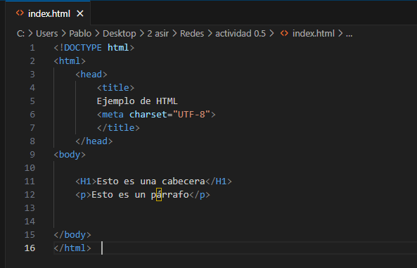
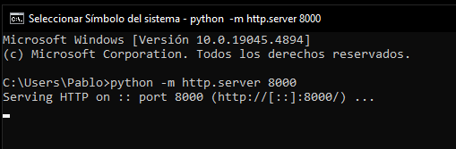
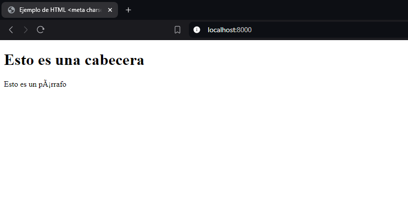
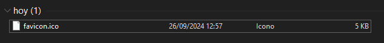

Primero vamos a crear un html para nuestra página web, para esto vamos a usar un editor de texto, en mi caso visual studio code.



Ahora vamos a poneren marcha el servidor web de Python a través del terminal con el siguiente comando:

```
python -m http.server 8000
```


Una vez el servidor abierto vamos a abrir el index creado anteriormente poniendo en el navegador "localhost:8000"



Ahora vamos a cambiar la imagen del servidor por una que nosotros queramos, para esto vamos a descargar una imagen cualquiera y le tendremos que cambiar el nombre a "favicon" y la extension deberá ser ".ico":


