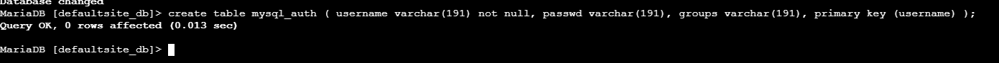
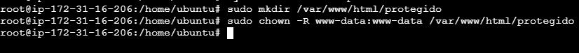

## 1. Activar la autenticación con MySql
<br>
Para empezar actualizaremos nuestro servidor de Ubuntu con los siguientes comandos:

```
sudo apt update
```


```
sudo apt upgrade
```

<br>
Una vez que ya tenemos nuestro Ubuntu Server actualizado empezaremos con la instalación de apache:
```
sudo apt-get install apache2
```

<br>
Ya instalado apache nos tocará instalar PHP y MySQL:
```
sudo apt-get install apache2 php7.0 libapruti11-dbd-mysql -y
```

<br>
También instalaremos MariaDB:
```
sudo apt-get install mariadb-server mariadb-client -y
```

<br>
Ya todo esto instalado tendremos que activar los servicios, tanto de apache como de mysql:
```
sudo systemctl enable apache2
```

```
sudo systemctl enable mysql
```

<br>
Iniciados los servicios tendremos que crear la base de datos, para esto primero tendremos que entrar en mysql con el comando:
```
sudo mysql -u root -p
```

<br>
Creamos la BD con el comando:
```
create database defaultsite_db;
```

<br>
Una vez creada la base de datos tendremos que darle permisos totales a nuestro usuario root:
```
GRANT SELECT, INSERT, UPDATE, DELETE ON defaultsite_db.* TO 'defaultsite_admin'@'localhost' IDENTIFIED BY 'usuario';
```
```
GRANT SELECT, INSERT, UPDATE, DELETE ON defaultsite_db.* TO 'defaultsite_admin'@'localhost.localdomain' IDENTIFIED BY 'password';
```
```
flush privileges;
```


Ya configurados los permisos para el root, vamos a entrar en la base de datos recién creada para crear los usuarios:
```
use defaultsite_db;
```

```
create table mysql_auth ( username varchar(191) not null, passwd varchar(191), groups varchar(191), primary key (username) );
```

<br> 
Encriptaremos la contraseña:
```
htpasswd -bns siteuser siteuser
```

<br>
Una vez nos da el hash tendremos que ponerlo en la tabla que creamos anteriormente de los usuarios, para esto tendremos que volver a entrar en la base de datos:
```
use defaultsite_db;
```
E introduciremos el siguiente comando:
```
INSERT INTO `mysql_auth` (`username`, `passwd`, `groups`) VALUES('siteuser', '{SHA}tk7HEH6Wo7SKT6+3FHCgiGnJ6dA=', 'sitegroup');
```

<br>
Activaremos los módulos dbd, authn_dbd, socache_shmcb, authn_socache:
```
sudo a2enmod dbd
```

```
sudo a2enmod authn_dbd
```

```
sudo a2enmod socache_shmcb
```

```
sudo a2enmod authn_socache
```

<br>
Una vez todos habilitados reiniciaremos apache:
```
systemctl restart apache2
```

<br>
Creamos el directorio protegido.
```
sudo mkdir /var/www/html/protegido
```
```
sudo chown -R www-data:www-data /var/www/html/protegido
```

<br>
Tendremos que cambiar la configuración de nuestro dominio:
```
sudo nano /etc/apache2/sites-available/000-default.conf
```

<br>
Tendremos que introducir las siguientes lineas:
<br>

<br>
Una vez hemos hecho estas modificaciones reiniciaremos apache
<br>
Y como podemos ver una vez ponemos el usuario y la contraseña estamos dentro:
<br>

