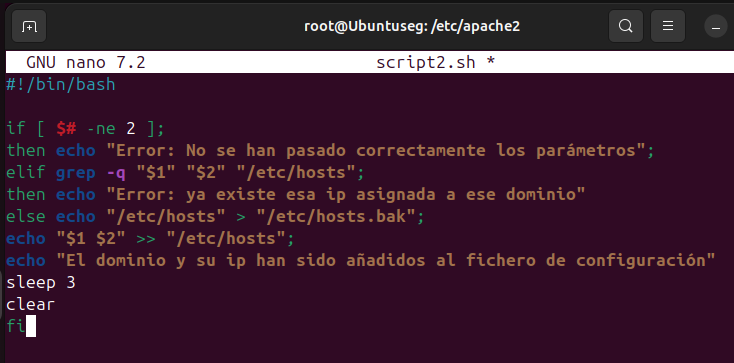

1. **Crea un script que añada un puerto de escucha en el fichero de configuración de Apache. El puerto se recibirá como parámetro en la llamada y se comprobará que no esté ya presente en el fichero de configuración.**
 
¿Qué acciones realiza este script?
 
-Verificación de parámetros 
-Verificación del puerto 
-Copia de seguridad y adición del puerto 

2. **Crea un script que añada un nombre de dominio y una ip al fichero hosts. Debemos comprobar que no existe dicho dominio en el fichero hosts**
 
¿Qué acciones realiza este script?
 
-Verificación de parámetros: Comprueba que se hayan pasado exactamente dos parámetros (una IP y un dominio). Si no es así, muestra un mensaje de error.
 
-Comprobación de existencia: Verifica si la IP y el dominio ya existen en el archivo /etc/hosts. Si ya existen, muestra un mensaje de error.
 
-Copia de seguridad y adición: Si no existen, realiza una copia de seguridad del archivo /etc/hosts y añade la nueva entrada (IP y dominio) al final del archivo, indicando que se ha añadido correctamente.
 

