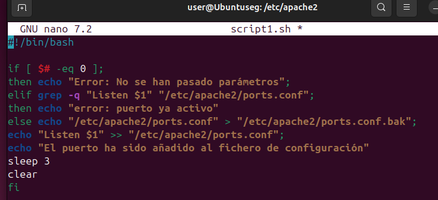

1. **Crea un script que añada un puerto de escucha en el fichero de configuración de Apache. El puerto se recibirá como parámetro en la llamada y se comprobará que no esté ya presente en el fichero de configuración.**
 
¿Qué acciones realiza este script?
 
-Verificación de parámetros 
-Verificación del puerto 
-Copia de seguridad y adición del puerto 

