## 1. Instalación del servidor web apache.
Usaremos dos dominios mediante el archivo hosts: `centro.intranet` y `departamentos.centro.intranet`
<br>
El primero servirá el contenido mediante wordpress y el segundo una aplicación en python.
<br>
Comenzaremos con la instalación de Apache, pero primero lo que vamos a hacer es actualizar nuestro ubuntu con los siguientes comandos:
<br><br>
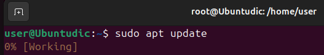
<br>
Una vez descargadas las actualizaciones vamos a instalarlas con el siguiente comando:
<br><br>
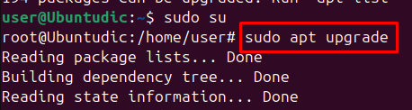
<br>
Ya tenemos nuestro sistema operativo actualizado vamos a comenzar con  la instalación de Apache.
<br>
Para la instalación de apache vamos a poner el siguiente comando:
<br>
```
sudo apt install apache2
```
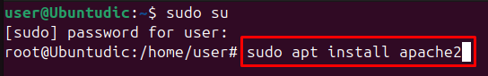
<br>
Ya instalado vamos a comprobar que todo este correctamente, para esto vamos a poner el siguiente comando:
<br>
```
service apache2 status
```


<br>
También podemos poner ```hhtp://localhost``` en el navegador de nuestra maquina virtual para comprobar que funciona correctamente.
<br>
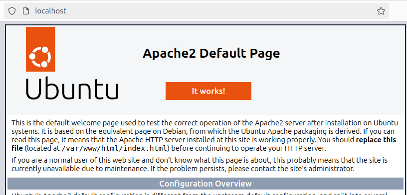
<br>
Y añadiremos los nombres de dominio que nos pide el ejercicio al archivo hosts.
<br>
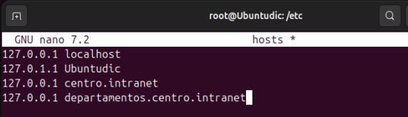
<br>
Para que se apliquen los cambios deberemos reiniciar apache con el comando: 
```
sudo service apache2 restart
```
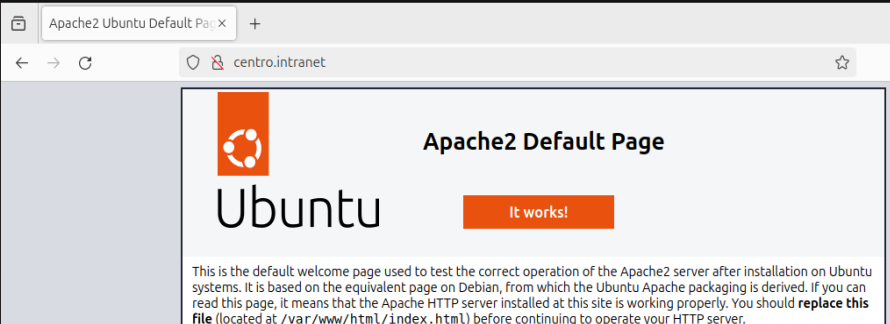
<br>
Y como podemos ver lo comprobamos con un dominio y esta correcto.
<br>

## 2. Activar los módulos necesarios para ejecutar php y acceder a mysql.
<br>
Vamos a comenzar con la instalación de MySql con el siguiente comando:
<br>

```
sudo apt install mysql-server
```

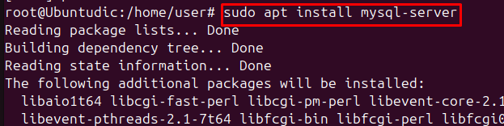
<br>
Comprobamos que MySQL esta instalado con el siguiente comando:
<br>

```
sudo mysql
```

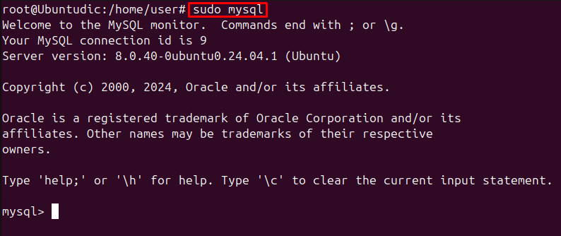
<br>
Vamos a seguir con la instalación de MySql con los siguientes comandos:
<br>
```
sudo mysql_secure_installation
```

En el primer paramatero que es el que nos van a preguntar sobre las contraseñas vamos a poner que no.
<br>
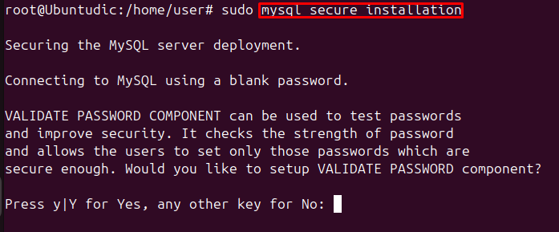
<br>
En el siguiente parámetro nos pregunta para quitar a los usuarios anonimos que puedan logearse en este caso seleccionaremos que si.
<br>
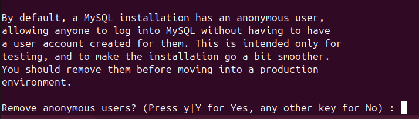
<br>
Seguimos rellenando los parámetros de configuración, esta vez sobre la conexión en remoto que la desactivaremos.
<br>
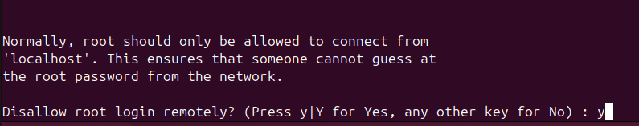
<br>
También quitaremos la base de datos que viene por defecto.
<br> 
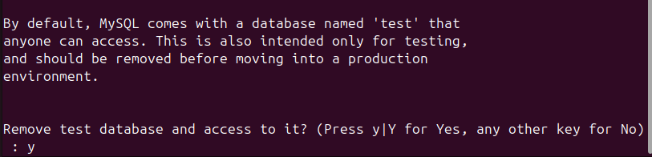
<br>
Y por último rechazaremos actualizar la tabla de privilegios.
<br>
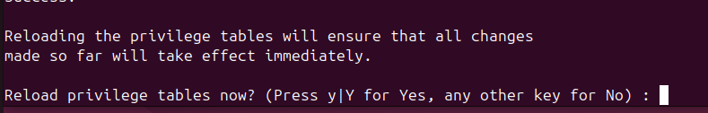
<br>
Con esto ya tendríamos mysql instalado correctamente.
<br>
Una vez ya instalado MYSql vamos a comenzar con la instalación de PHP, con el siguiente comando:
<br>
```
sudo apt install php libapache2-mod-php php-myslq
```

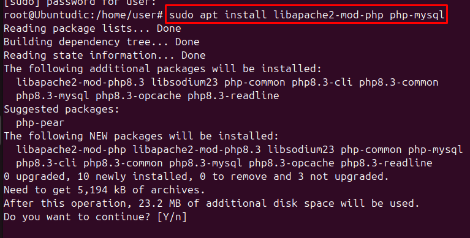
<br>
Para comprobar que la instalación se ha llevado a cabo correctamente podemos poner el comando ```php -v``` y, si se ha instalado php correctamente nos deberá decir la versión de nuestro php ya instalado:
<br>
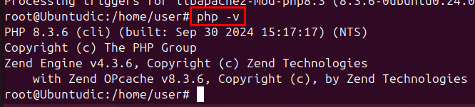
<br>
## 2. Instala y configura Wordpress.
<br>
Empezaremos creando las carpetas donde vamos a tener los dominios que nos pide el ejercicio, para crear las carpetas donde vamos a tener nuestro dominio con el siguiente comando:
<br>

```
sudo mkdir /var/www/centro.intranet
``` 

Y para nuestro segundo dominio:
<br>

```
sudo mkdir /var/www/departamentos.centro.intranet
``` 
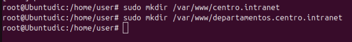

<br>
También crearemos los archivos de configuración de ambas páginas con el comando:

```
sudo nano /etc/apache2/sites-avaiable/centro.intranet.conf
```
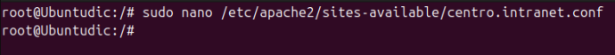

<br>
Y rellenamos su configuración:
<br>

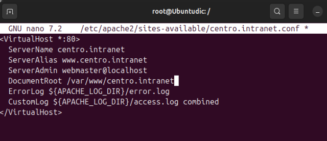
<br> 
Y haremos exactamente lo mismo con el otro dominio.
<br>

<br>
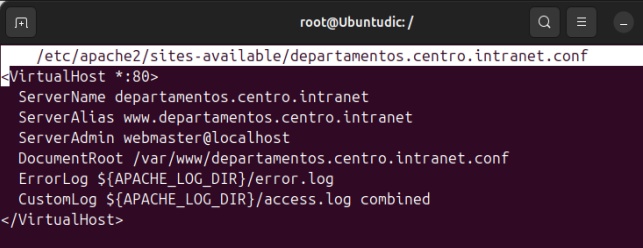


