## 1. Instalación del servidor web apache.
Usaremos dos dominios mediante el archivo hosts: `centro.intranet` y `departamentos.centro.intranet`
<br>
El primero servirá el contenido mediante wordpress y el segundo una aplicación en python.
<br>
Comenzaremos con la instalación de Apache, pero primero lo que vamos a hacer es actualizar nuestro ubuntu con los siguientes comandos:
<br><br>

<br>
Una vez descargadas las actualizaciones vamos a instalarlas con el siguiente comando:
<br><br>

<br>
Ya tenemos nuestro sistema operativo actualizado vamos a comenzar con  la instalación de Apache.
<br>
Para la instalación de apache vamos a poner el siguiente comando:
<br>
```
sudo apt install apache2
```

<br>
Ya instalado vamos a comprobar que todo este correctamente, para esto vamos a poner el siguiente comando:
<br>
```
service apache2 status
```


<br>
También podemos poner ```hhtp://localhost``` en el navegador de nuestra maquina virtual para comprobar que funciona correctamente.
<br>

<br>
Y añadiremos los nombres de dominio que nos pide el ejercicio al archivo hosts.
<br>

<br>
Para que se apliquen los cambios deberemos reiniciar apache con el comando: 
```
sudo service apache2 restart
```

<br>
Y como podemos ver lo comprobamos con un dominio y esta correcto.
<br>

## 2. Activar los módulos necesarios para ejecutar php y acceder a mysql.
<br>
Vamos a comenzar con la instalación de MySql con el siguiente comando:
<br>

```
sudo apt install mysql-server
```


<br>
Comprobamos que MySQL esta instalado con el siguiente comando:
<br>

```
sudo mysql
```


<br>
Vamos a seguir con la instalación de MySql con los siguientes comandos:
<br>
```
sudo mysql_secure_installation
```

En el primer paramatero que es el que nos van a preguntar sobre las contraseñas vamos a poner que no.
<br>

<br>
En el siguiente parámetro nos pregunta para quitar a los usuarios anonimos que puedan logearse en este caso seleccionaremos que si.
<br>

<br>
Seguimos rellenando los parámetros de configuración, esta vez sobre la conexión en remoto que la desactivaremos.
<br>

<br>
También quitaremos la base de datos que viene por defecto.
<br> 

<br>
Y por último rechazaremos actualizar la tabla de privilegios.
<br>

<br>
Con esto ya tendríamos mysql instalado correctamente.
<br>
Una vez ya instalado MYSql vamos a comenzar con la instalación de PHP, con el siguiente comando:
<br>
```
sudo apt install php libapache2-mod-php php-myslq
```


<br>
Para comprobar que la instalación se ha llevado a cabo correctamente podemos poner el comando ```php -v``` y, si se ha instalado php correctamente nos deberá decir la versión de nuestro php ya instalado:
<br>

<br>
Empezaremos creando las carpetas donde vamos a tener los dominios que nos pide el ejercicio, para crear las carpetas donde vamos a tener nuestro dominio con el siguiente comando:
<br>

```
sudo mkdir /var/www/centro.intranet
``` 

Y para nuestro segundo dominio:
<br>

```
sudo mkdir /var/www/departamentos.centro.intranet
``` 


<br>
También crearemos los archivos de configuración de ambas páginas con el comando:

```
sudo nano /etc/apache2/sites-avaiable/centro.intranet.conf
```


<br>
Y rellenamos su configuración:
<br>


<br> 
Y haremos exactamente lo mismo con el otro dominio.
<br>

<br>

<br> 
Ya creados los ficheros de configuración vamos a activar los sitios web con los siguientes comandos:
```
sudo a2ensite centro.intranet
```
```
sudo a2ensite departamentos.centro.intranet
```
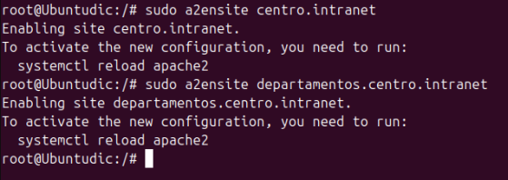
<br> 
Como podemos ver en la captura nos pide que para que estos cambios se apliquen deberemos poner el comando:
```
systemctl reload apache2
```
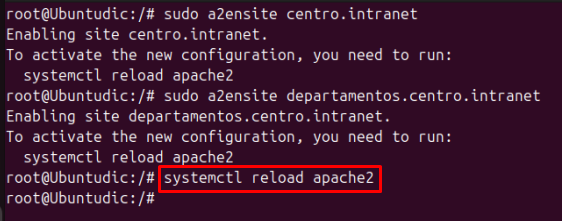

## 3. Instala y configura Wordpress.
<br>
Lo primero que vamos a hacer es instalar MariaDB y Worpress.
<br>
Para instalar MariaDB utilizaremos el siguiente comando:

```
sudo apt-get install mariadb-client mariadb-server
```
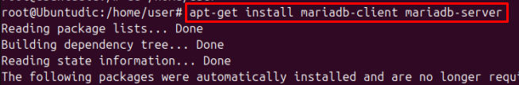
<br>
Para instalar Wordpress utilizaremos el siguiente comando:

```
sudo wget https://wordpress.org/latest.tar.gz
```
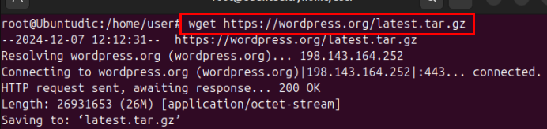
<br>
Una vez lo tenemos descargado lo vamos a descomprimir con el comando:
```
tar -xzf latest.tar.gz
```
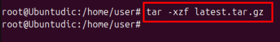
<br>
Una vez descomprimido, vamos a moverlo al directorio de nuestra página:
```
sudo mv wordpress/* /var/www/centro.intranet
```
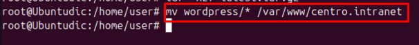
<br>
Podemos ver que se ha movido correctamente con el comando:
```
ls /var/www/centro.intranet
```
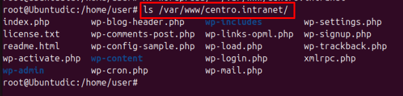
<br>
Antes de configurar wordpress tendremos que crear la base de datos en Maria DB, para esto entramos en MariaDB con el comando:
```
sudo mariadb
```
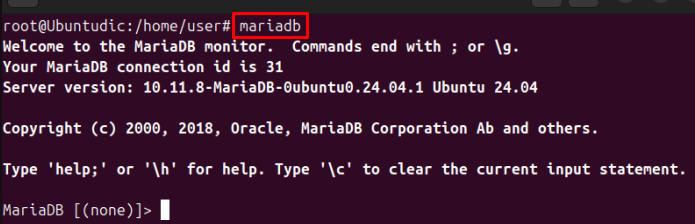
<br>
Y crearemos la Base de datos:
<br>
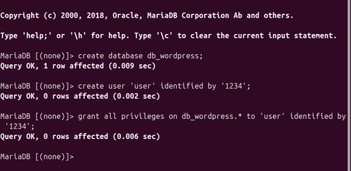
<br>
Una vez creada la DB vamos a configurar el archivo de configuración de Wordpress:
```
sudo nano /var/www/centro.intranet/wp-config.php
```
Al que le añadiremos las siguientes lineas:
```
define( 'DB_NAME', 'db_wordpress' );

define( 'DB_USER', 'user' );

define( 'DB_PASSWORD', '1234' );
```
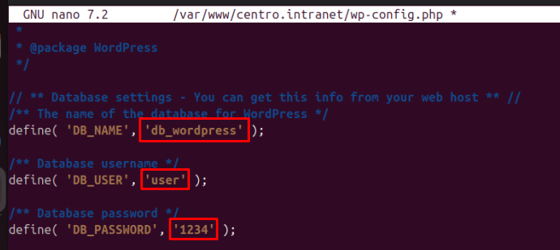
<br>
Ya configurado el archivo de configuración, entraremos en el wordpress y nos aparecerá el siguiente asistente que nos ayudará a configurarlo:
<br>
Lo rellenamos con nuestros datos:
<br>
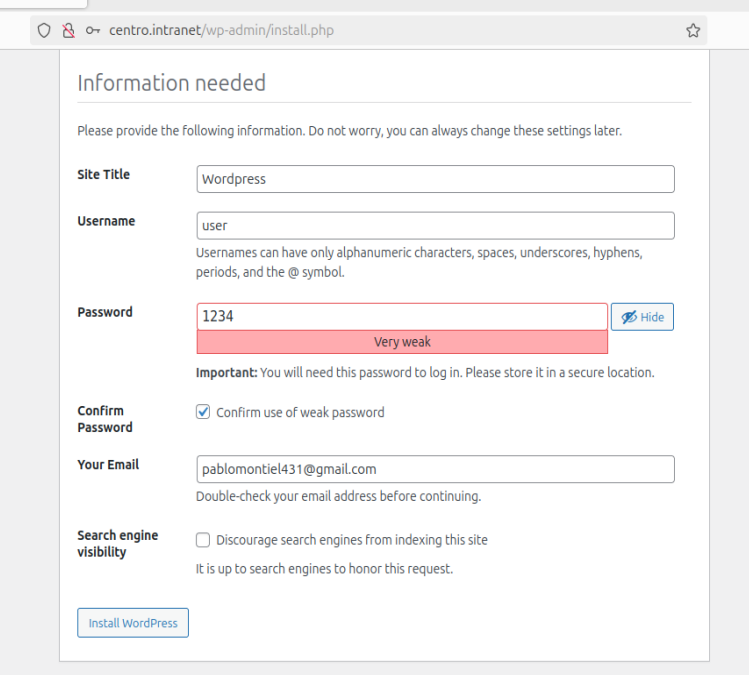
<br>
Como podemos ver se ha instalado correctamente:
<br>
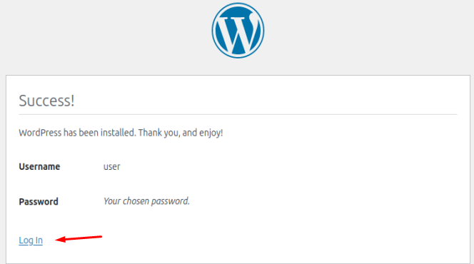
<br>
Una vez ya configurado pulsaremos "log in"
<br>
Iniciamos sesión con nuestras credenciales:
<br>
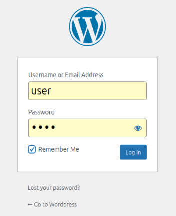
<br>
Y como podemos ver nos entra a la página del administrador:
<br>
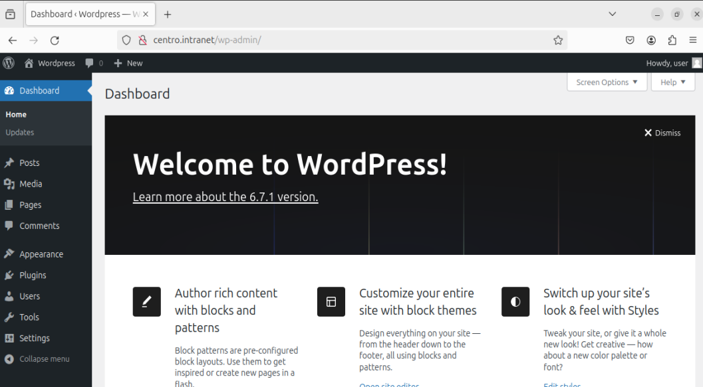
<br>
## 4. Activar el módulo “wsgi” para permitir la ejecución de aplicaciones Python.
<br>
Para activar el módulo "wsgi" simplemente tendremos que ejecutar el siguiente comando:

```
sudo apt-get install libapache2-mod-wsgi-py3
```
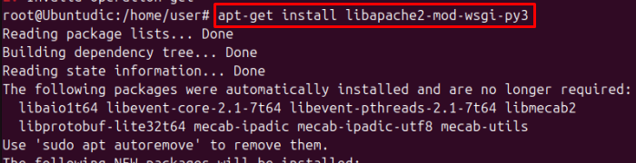
<br>
## 5. Crea y despliega una pequeña aplicación python para comprobar que funciona correctamente.
Lo primero que vamos a hacer es irnos al directorio donde va a estar la app:
```
cd /var/www/departamentos.centro.intranet
```
Una vez aquí creamos los directorios necesarios
```
mkdir pythonprueba
mkdir public_html
mkdir logs
```
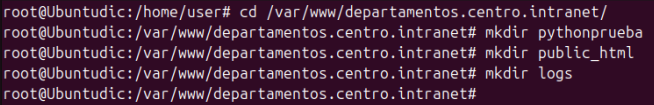
<br>
Ya todo listo vamos a crear la aplicación Python:
```
echo '# -*- coding: utf-8 -*-' > pythonprueba/controller.py
```
Una vez creado el archivo lo modificamos:
```
def application(environ, start_response):
  output = b'<p>Bienvenido a <b>Departamentos<b>!!!</p>'
  start_responde('200 OK', [('Content-Type', 'text/html; charset=utf-8')])
  return [output]
```
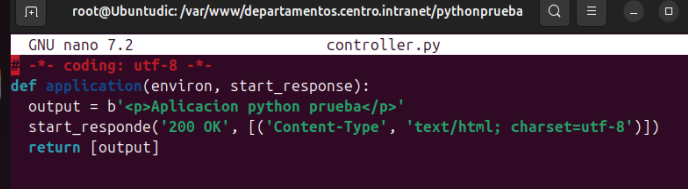
<br>
Ahora deberemos tocar el archivo de configuración del dominio "departamentos.centro.intranet" para que cuando lo busquemos salga nuestra app python:
<br>
Añadiremos lo siguiente:
```
DocumentRoot /var/www/departamentos.centro.intranet/public_html
WSGIScriptAlias / /var/www/departamentos.centro.intranet/pythonprueba/controller.py
ErrorLog /var/www/departamentos.centro.intranet/logs/error.log
CustomLog /var/www/departamentos.centro.intranet/logs/access.log combined

<Directory />
  Options FollowSymLinks
  AllowOverride All
</Directory>
```
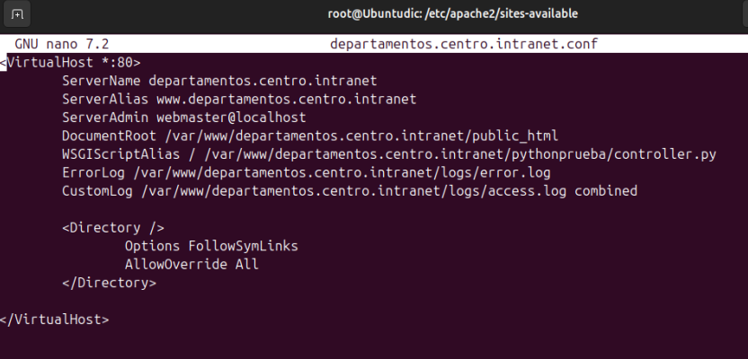
<br>
Y ya estaria nuestra app python en funcionamiento:
<br>
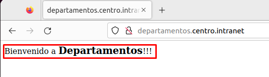

## 6. Adicionalmente protegeremos el acceso a la aplicación python mediante autenticación.
<br>
Lo primero que vamos a hacer es crear un directorio para almacenar las credenciales:

```
mkdir /var/www/departamentos.centro.intranet/passwd
```
Una vez ya tenemos el directorio creamos la contraseña con el comando:
```
htpasswd -c /var/www/departamentos.centro.intranet/passwd/passwords user
```
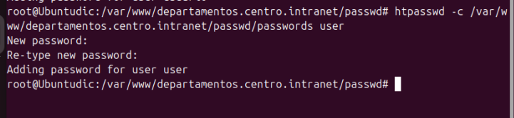
<br>
Y anadiremos lo siguiente dentro del fichero de configuración del servidor:
```
<Directory /var/www/departamentos.centro.intranet/pythonprueba>
  AuthType Basic
  AuthName "Restricted Files"
  AuthUserFile /var/www/departamentos.centro.intranet/passwd/passwords
  Require user user
</Directory>
```

<br>
Y como podemos ver ahora al intentar entrar nos pide la contraseña:
<br>

<br>
## 7. Instala y configura awstat.
<br>
Empezaremos instalando el servicio de awstats con el comando:

```
sudo apt-get install awstats
```
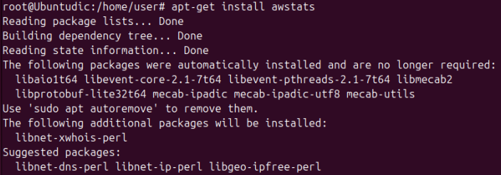
<br>
Ya instalado vamos a activar el modulo CGI con el comando:
```
sudo a2enmod cgi
```
También deberemos reiniciar apache ya que nos lo pide al activar el modulo CGI:
<br>
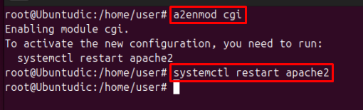
<br>
Ahora modificaremos el archivo de configuración de awstats con el comando:
```
sudo nano /etc/awstats/awstats.conf
```
Tendremos que cambiar los siguientes parámetros:
<br>
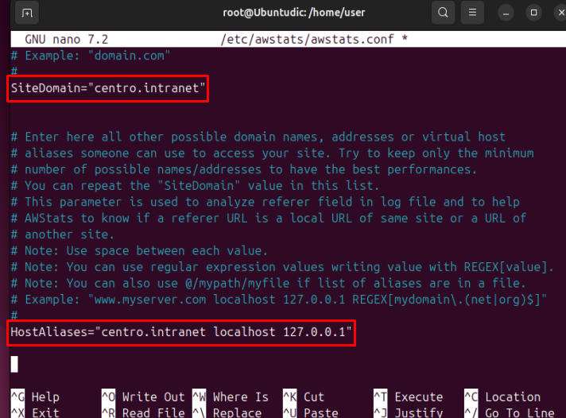
<br>
Ademas también realizaremos este otro cambio:
<br>
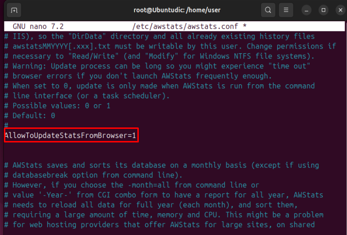
<br>
Ya modificados ambos parámetros tendremos que empezar con unas estadísticas, las cuales generaremos con el siguiente comando:
```
sudo /usr/lib/cgi-bin/awstats.pl -config=centro.intranet -update
```
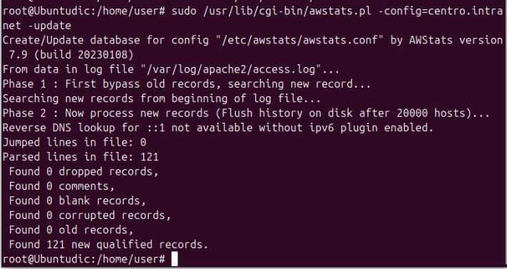
<br>
Por último haremos unas configuraciones en apache con los siguientes comandos:
<br>
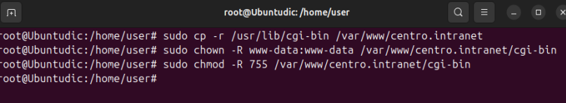
<br>
También crearemos el archivo de configuración de awstats en apache con el comando:
```
sudo nano /etc/apache2/conf-available/awstats.conf
```
Y añadiremos lo siguiente:
<br>
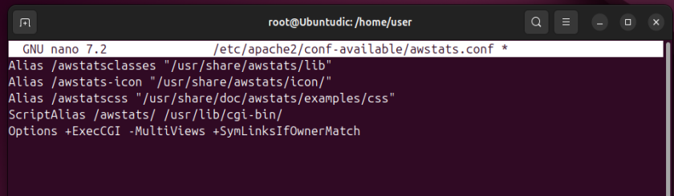
<br>
Para que todo esto se aplique deberemos habilitar la configuración de awstats:
<br>
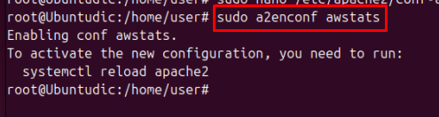
<br>
Y nos pedirá que reiniciemos apache2
<br>
Ahora vamos a acceder a "http://centro.intranet/awstats/awstats.pl" y nos aparecerán las estadisticas de nuestra página web.
<br>
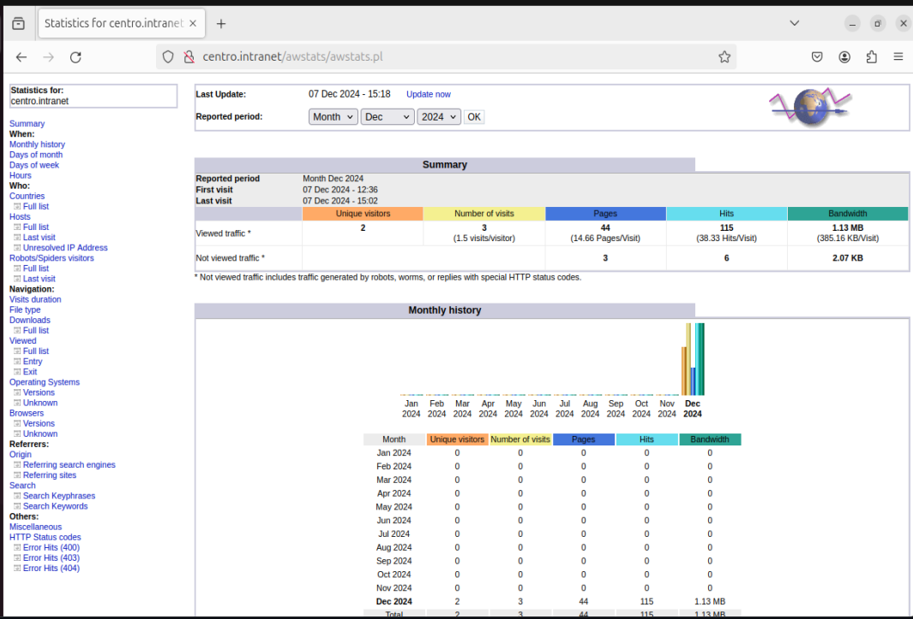
<br>
## 8. Instala un segundo servidor de tu elección (nginx, lighttpd) bajo el dominio “servidor2.centro.intranet”. Debes configurarlo para que sirva en el puerto 8080 y haz los cambios necesarios para ejecutar php. Instala phpmyadmin.
