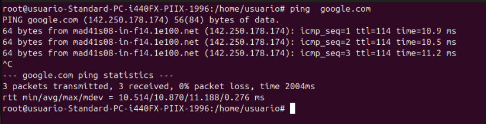

# Instalación del servidor DNS Bind
 
Lo primero que vamos a hacer es actualizar nuestra máquina con los siguientes comandos:
 

 

 
Una vez el sistema está actualizado vamos a comenzar con la instalación del servicio Bind
 

 
Ya instalado pasaremos a la carpeta de configuración de bind que se encuentra en la ruta "/etc/bind/namedd.conf.options"
 

 
Dentro del archivo vamos a introducir los siguientes parámetros
 

 
Para validar la configuración vamos a poner el siguiente comando
 

 
Y para aplicar los cambios vamos a reiniciar el servidor BIND
 

 
Para que no tengamos problemas con el cortafuegos, vamos a habilitar Bind9
 

 
Y estableceremos como servidor DNS la ip de nuestra máquina, para esto vamos a editar el archivo "/etc/resolv.conf"
 

 
Ya dentro del archivo ponemos nuestra ip
 

 
Vamos a probar que tenemos conexión haciendo un ping a google
 

