# Práctica 1- Servidor alojamiento web

## Creación de la VPC
 
Lo primero que vamos a hacer es entrar al laboratorio AWS
 

 
Una vez dentro de AWS nos iremos al buscador y buscaremos el servicio "VPC"
 

 
Ya dentro del servicio VPC lo crearemos
 

 
Ya creado empezaremos a con su configuración
 

 
Configuraremos las ips para que tengamos 2 subredes públicas y 2 privadas
 

 
El resto lo dejaremos por defecto y crearemos la VPC
 

 
Y como podemos ver ya se empezaría a crear el VPC
 

 
Ya la tenemos creada:
 

 
## Creamos la instancia con EC2 
 
Lo primero que vamos a hacer es buscar en los servicios EC2
 

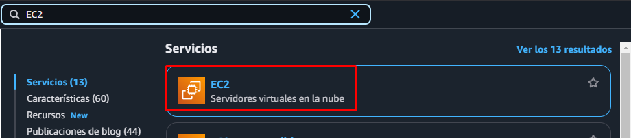
 
Una vez ya dentro de EC2 lanzaremos la instancia
 

 
Empezaremos configurando el sistema operativo
 

 
Tambíen seleccionaremos el tipo de instancia y el par de claves
 

  
La configuración de red
 

 
Y por último configuraremos el firewall con las reglas de entrada tanto ssh como http
 

 
Ya todo configurado lanzaremos la instancia
 

 
Como podemos ver el lanzamiento no tuvo ningun fallo
 

 
Y ya tendremos nuestra instancia creada
 

 
## Instalación de Apache
 
Antes de instalar apache o php deberemos actualizar nuestra maquina con los comandos:
 

 

 
Una vez ya hemos actualizado nuestra máquina deberemos instalar apache2 con el comando:
 

 
Ya instalado vamos a iniciarlo y lo activaremos
 

 

 
Para comprobar que funciona correctamente deberemos copiar la ip publica de nuestra máquina, la cual nos aparecerá debajo de la consola
 

  
Y la pegaremos en el navegador y nos deberería salir la página de apache
 

 
Ya instalado apache2, vamos a comenzar con la instalación de PHP
 
## Instalación de PHP
 
Lo primero que vamos a hacer es añadir un repositorio a nuestra máquina con el comando:
 

 
Ya añadido el repositorio instalaremos PHP
 

 
E instalaremos Mysql
 

 
Ya instalados vamos a reiniciar apache2
 

 
Para comprobar que se ha instalado correctamente verificaremos la versión de PHP con el comando:
 

 
Como podemos ver nos da la versión lo que significa que lo tenemos instalado correctamente.
 
## Creamos la base de datos
 
Como ya hemos hecho previamente con los demás servicios, buscaremos el servicio RDS en el buscador de AWS
 

 
Una vez dentro de RDS podremos ver la opción de "Crear Base de datos"
 

 
Empezaremos con la configuración de la base de datos eligiendo el motor MYSQL
 

 
Deberemos elegir en el apartado de "Plantillas" la capa gratuita
 

 
Nos pedirá que le asignemos un nombre y un usuario y contraseña con el que acceder a la base de datos en mi caso "admin" "12345678"
 

 
Dejaremos la siguiente configuración por defecto
 

 
En el apartado de conectividad tendremos que asignar la VPC que creamos anteriormente
 

 
En el apartado de seguridad del VPC le asignaremos un nombre, en mi caso "SeguridadDB"
 

 
El apartado "Supervisión" lo dejaremos por defecto
 

 
Lo único que nos queda es asignarle un nombre a nuestra base de datos
 

 
Y crearemos la base de datos
 
Como podemos ver la base de datos ya esta creada
 

 
Una vez creada tendremos que configurarla en un EC2, para esto tendremos que irnos a nuestra base de datos y entrar en el apartado "Acciones"
 

 
Seleccionamos la EC2 que creamos anteriormente y continuamos
 

 
Nos pondrán los cambios que se han llevado a cabo, le damos a "Configurar"
 

 
Y como podemos ver nos pone que la conexión se ha establecido con exito
 

 
## Creación del EFS
 
Para crear el sistema de ficheros vamos a hacer como con los servicios anteriores, buscaremos el servicio EFS en el buscador de AWS
 

 
Una vez dentro seleccionaremos el apartado "Crear un sistema de archivos"
 
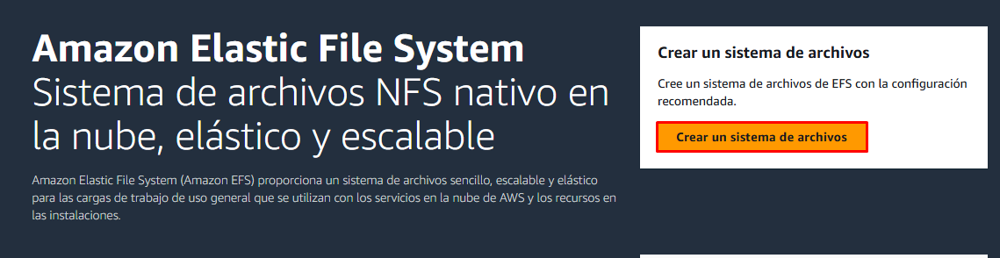
 
Para crear el sistema de archivos, le daremos un nombre y le asignaremos la VPC que creamos anteriormente.
 
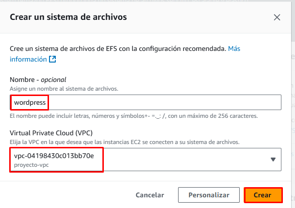
 
Como podemos ver se ha creado correctamente
 
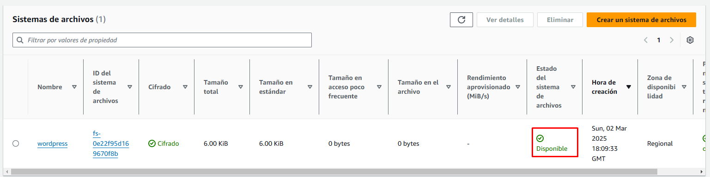
 
Una vez creado nos tendremos que ir a la configuración de la VPC en mi caso "wordpress" para añadir una regla de entrada
 
Seleccionamos el VPC al que le queremos añadir la regla
 
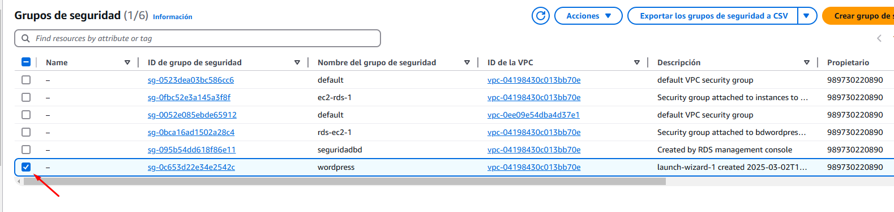
 
Nos vamos al apartado "Reglas de entrada" y le damos a "Editar reglas de entrada"
 
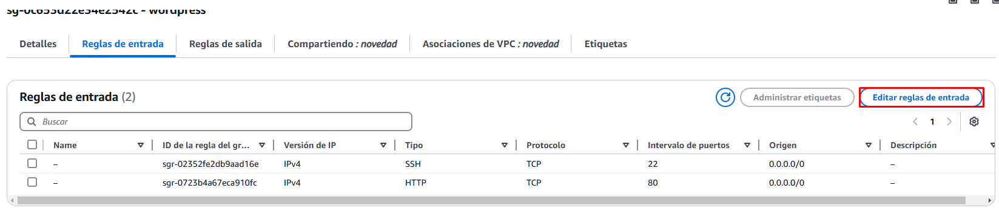
 
Estableceremos una regla para el protocolo NFS que solo se pueda conectar a través de nuestra VPC
 
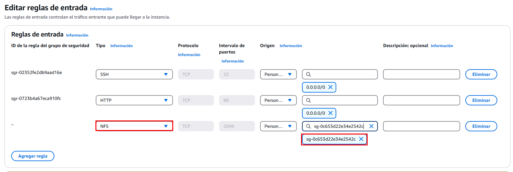
 
Ahora nos vamos a EFS, al apartado de "Red"
 
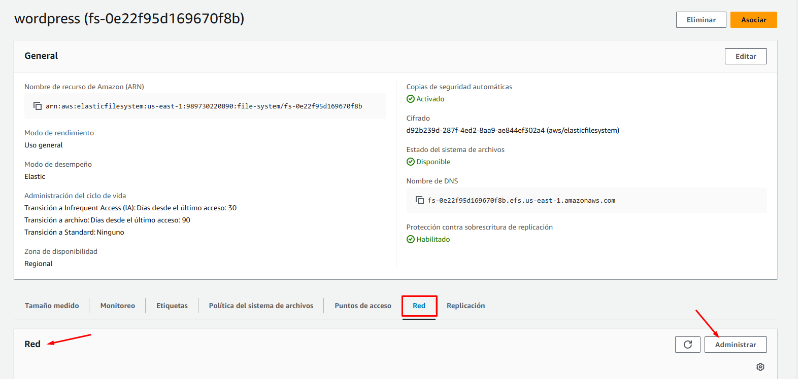
 
Y cambiamos la VPC que viene por defecto, por la que creamos nosotros
 
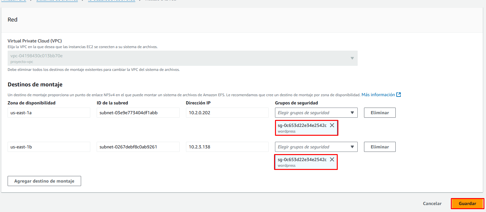
 
Una vez hecho los cambios, tendremos que asociarla con la máquina donde va a estar wordpress
 
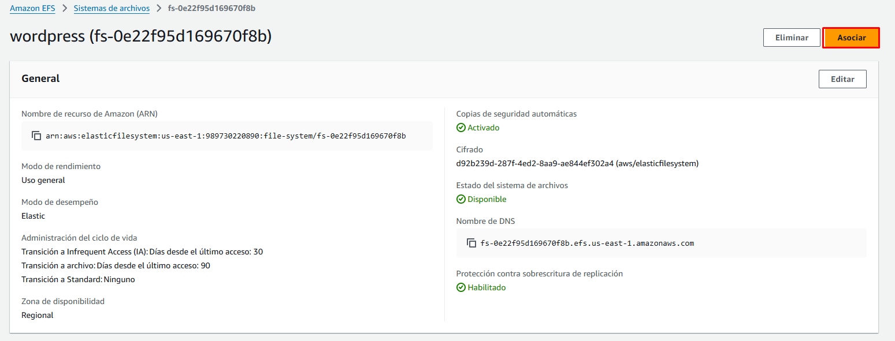
 
La asociaremos mediante ip, nos dará un codigo el cuál deberemos introducir en la máquina para asociarla
 
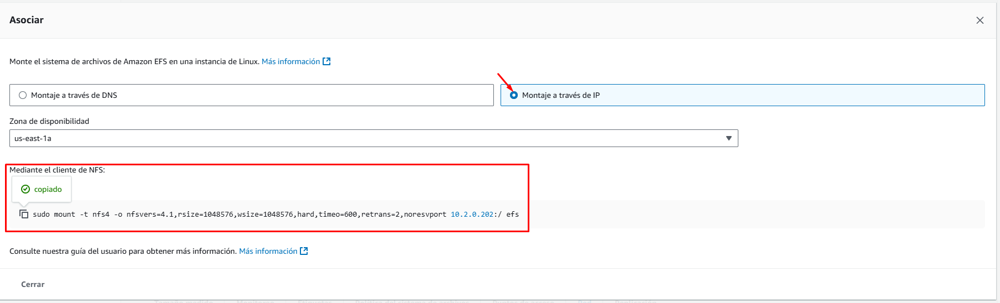
 
Pero antes de introducir ese comando deberemos instalar en nuestra máquina "NFS" con el comando:
 
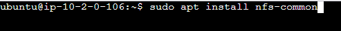
 
Ya instalado deberemos ejecutar el comando que nos daba EFS
 

 
Y como podemos ver ya tenemos el directorio "EFS"
 
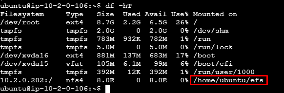
 

## Instalación de Wordpress
 
Empezaremos descargando Wordpress con el comando
 

 
Una vez descargado debemos descomprimirlo
 
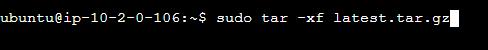
 
Como podemos ver ya tenemos wordpress instalado en el directorio "/var/www/html"
 

 
Ya instalado wordpress necesitaremos un cliente MYSQL para crear la base de datos de wordpress
 
Instalaremos el cliente con el comando
 
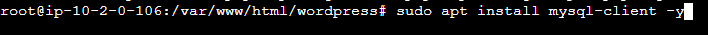
 
Ya con el cliente instalado tendremos que entrar en MYSQL 
 

 
Y crearemos la base de datos para wordpress
 
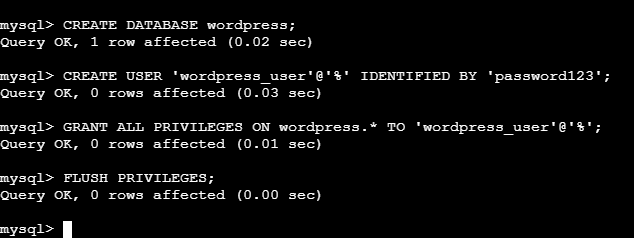
 
Una vez creada la base de datos entraremos en wordpress desde nuestro navegador para empezar a configurarlo, para entrar deberemos poner la ip de nuestra máquina en mi caso 54.211.14.162 seguida de la palabra wordpress.
 
Quedaría tal que así : "54.211.14.162/wordpress/"
 
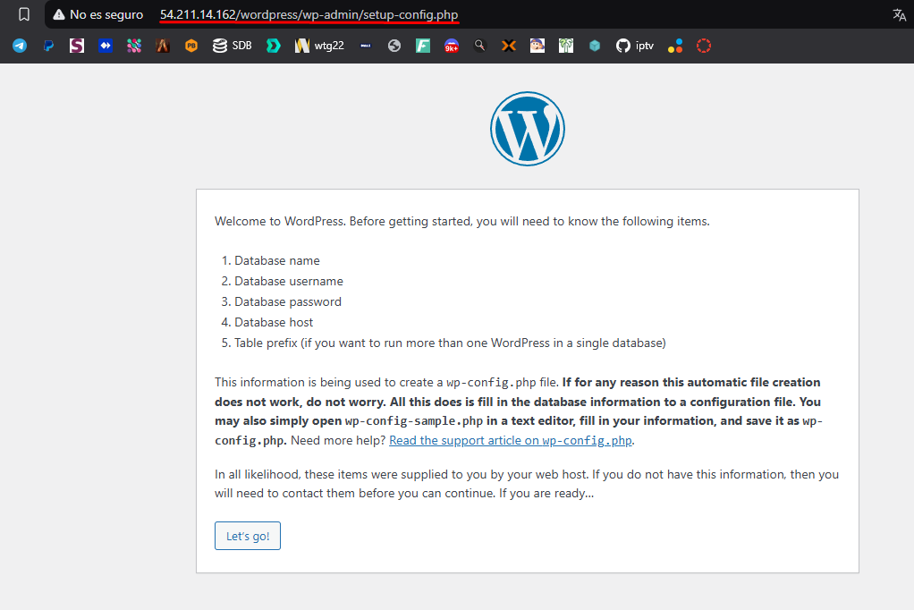
 
Y empezaremos con la configuración de wordpress, nos pedirán parametros básicos como el nombre de la base de datos, el usuario y contraseña del root...
 

 

