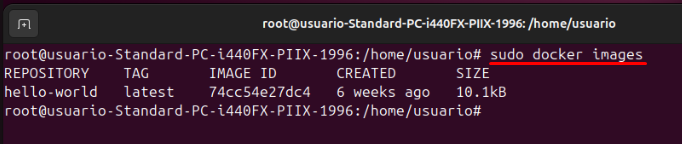
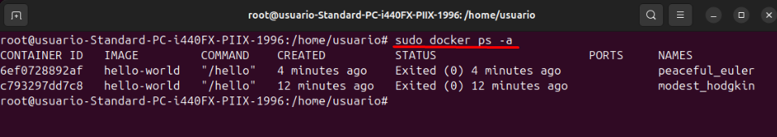
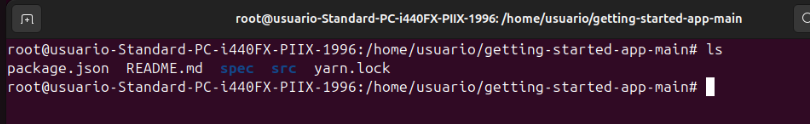
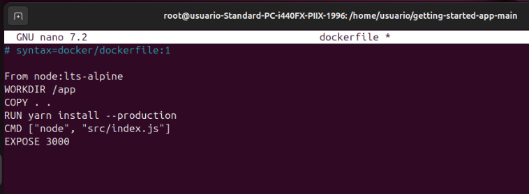
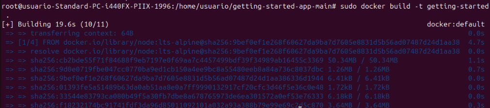
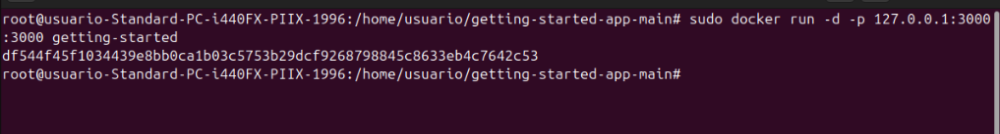
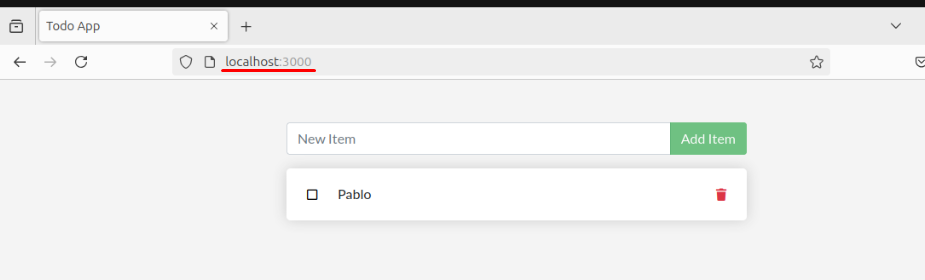
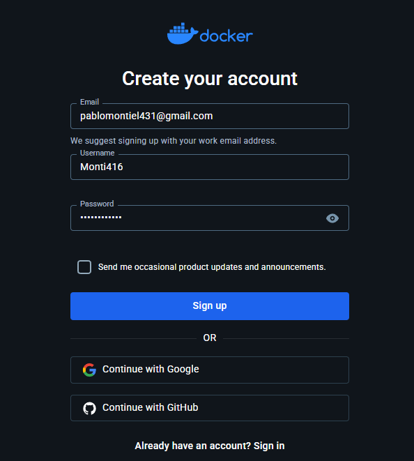

# Docker Práctica 2

## Lleva a cabo la práctica descrita en el primer artículo

### 1. Ejecuta la imagen `hello-world`.
 
Para ejecutar la imagen "hellow-world" tendremos que introducir el siguiente comando
 

 
### 2. Muestra las imágenes Docker instaladas.
 
Para mostrar las imagenes de docker instaladas utilizaremos el comando
 

 
### 3. Muestra los contenedores Docker.
 
Para mostrar los contenedores de Docker utilizaremos el comando
 

 
## Lleva a cabo la práctica descrita en el segundo artículo

### 1. Edita el fichero Dockerfile.
 
Lo primero que tenemos que buscar es una aplicación para editar, el mismo Docker en su Github tiene una llamada "getting-started-app.git", por lo cuál es la que escogeremos
 

 
Y editaremos el archivo con los siguientes parámetros
 

 
### 2. Construye el contenedor.
Para construir el contenedor vamos a usar el comando "build"
 

 
### 3. Ejecutalo.
 
Usaremos el comando "run"
 

 
Como podemos ver ya esta funcionando correctamente
 

 
### 4. Crea una cuenta en hub.docker.com
 
Creamos la cuenta
 

 
