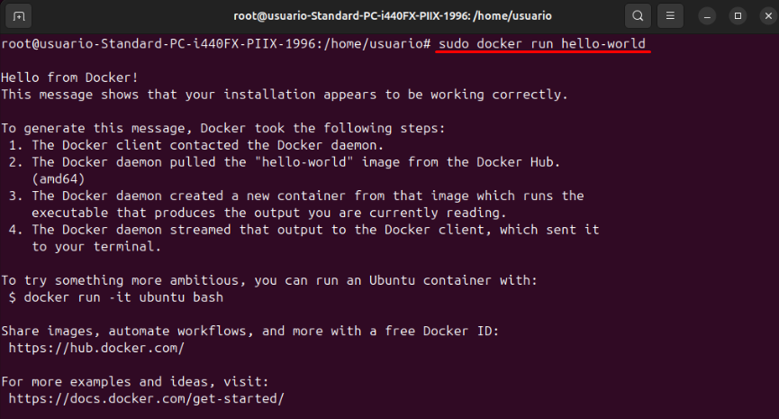

# Docker Práctica 2

## Lleva a cabo la práctica descrita en el primer artículo

### 1. Ejecuta la imagen `hello-world`.
 
Para ejecutar la imagen "hellow-world" tendremos que introducir el siguiente comando
 

 
### 2. Muestra las imágenes Docker instaladas.
 
Para mostrar las imagenes de docker instaladas utilizaremos el comando
 

 
### 3. Muestra los contenedores Docker.
 
Para mostrar los contenedores de Docker utilizaremos el comando
 

 
## Lleva a cabo la práctica descrita en el segundo artículo
 
### 1. Edita el fichero Dockerfile.
