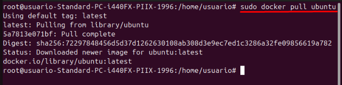
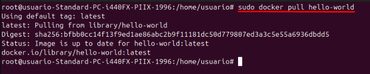
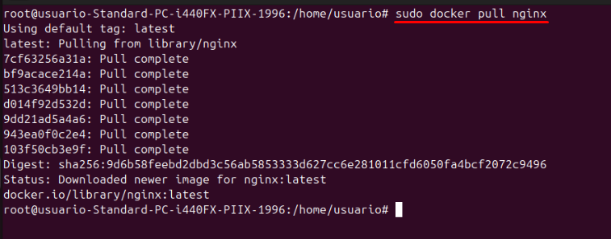

# Docker Práctica 3
## Descarga la imagen de ubuntu
Vamos a descargar la imagen con el comando
 

 
## Descarga la imagen de Hello-World
Vamos a descargar la imagen con el comando
 

 
## Descargar la imagen de Nginx
Vamos a descargar la imagen con el comando
 

