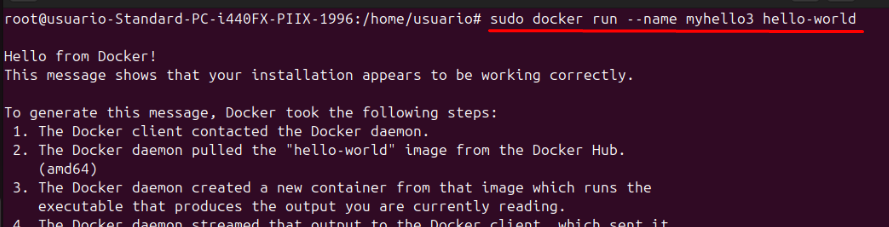

# Docker Práctica 3
## Descarga la imagen de ubuntu
Vamos a descargar la imagen con el comando
 

 
## Descarga la imagen de Hello-World
Vamos a descargar la imagen con el comando
 

 
## Descargar la imagen de Nginx
Vamos a descargar la imagen con el comando
 

 
## Muestra un listado de todas la imágenes
Para mostrar el listado de todas las imágenes usaremos el comando:
 

 
## Ejecuta un contenedor hello-world y dale nombre “myhello1”
Ejecutaremos el contenedor Hello-World y le pondremos de nombre "myhello1"
 

 
## Ejecuta un contenedor hello-world y dale nombre “myhello2”
Ejecutaremos el contenedor Hello-World y le pondremos de nombre "myhello2"
 

 
## Ejecuta un contenedor hello-world y dale nombre “myhello3"
Ejecutaremos el contenedor Hello-World y le pondremos de nombre "myhello3"
 

 
