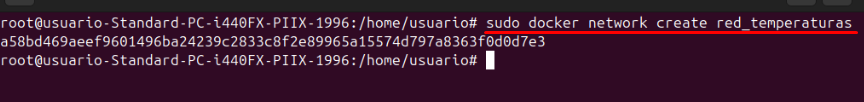
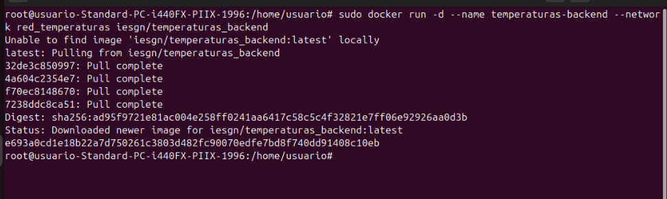
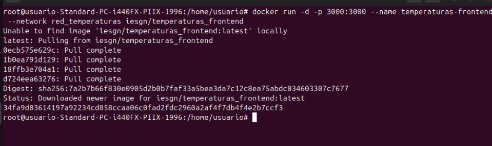
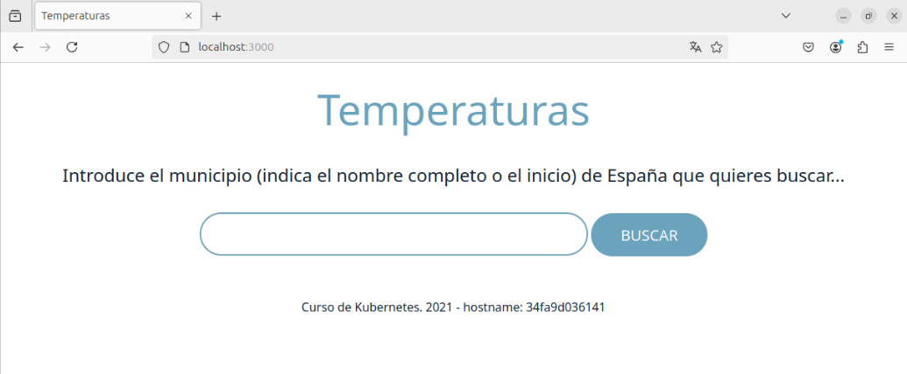

# Docker Práctica 4
## Despliegue de la aplicación Temperaturas

Primero vamos a crear una red Docker para la aplicación
 

 
Una vez creada la red, desplegaremos el backend de nuestra app
 

 
Por ultimo desplegaremos el frontend de la app y le daremos el puerto 3000
 

 
Como podemos ver, si accedemos a "localhost:3000" podremos ver nuestra aplicación
 

 
