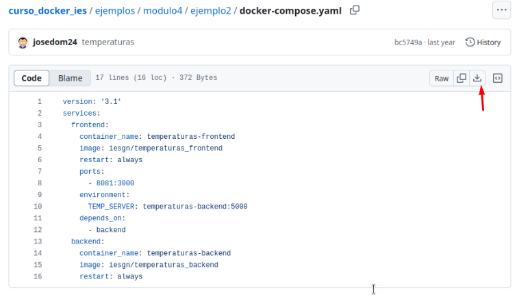
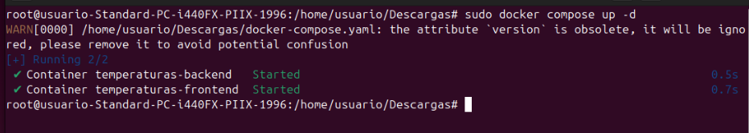
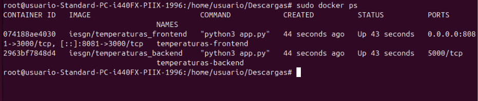
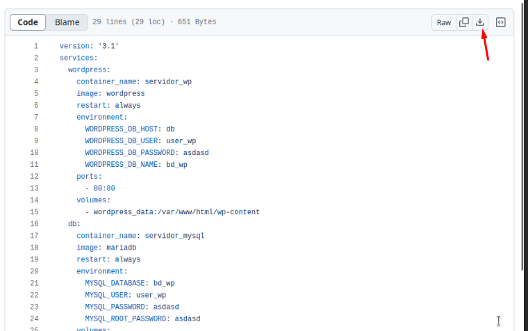
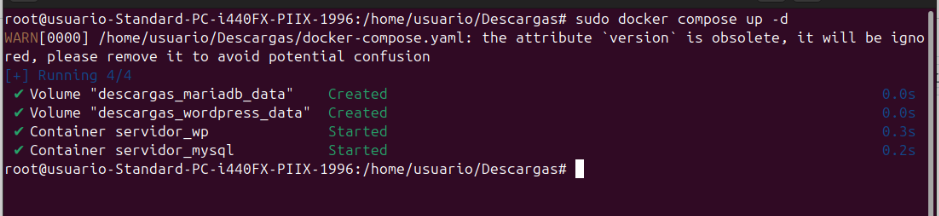
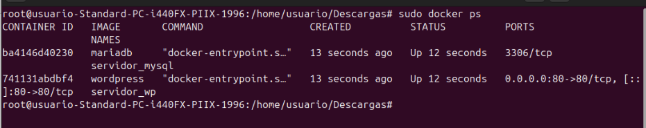

# Docker Práctica 5
## Despliegue de la aplicación Temperaturas
Primero vamos a descargar el archivo docker-compose.yml que contiene la configuración para dos servicios: frontend y backend
 

 
Desplegaremos los contenedores
 

 
Como podemos ver los contenedores se han desplegado correctamente 
 

 
## Despliegue WordPress con MariaDB
Primero vamos a descargar el archivo docker-compose.yml que contiene la configuración para dos servicios: frontend y backend
 

 
Desplegaremos los contenedores
 

 
Como podemos ver los contenedores se han desplegado correctamente 
 

