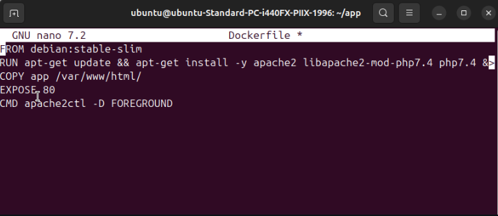
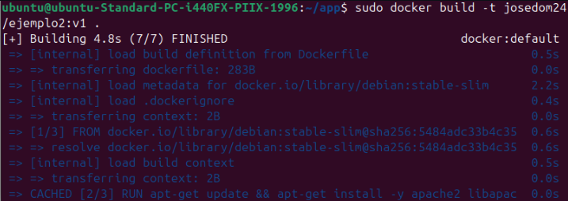
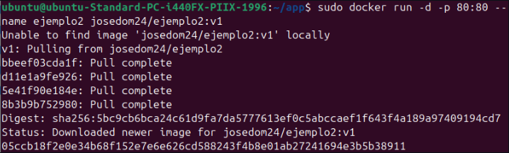
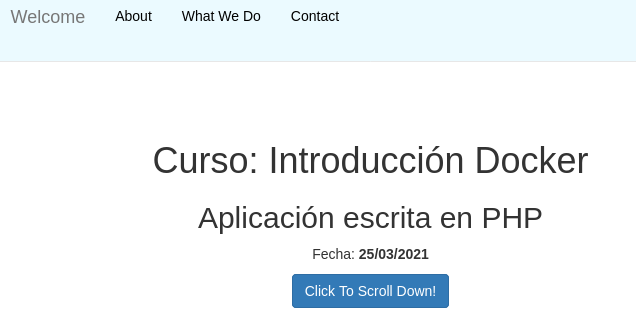
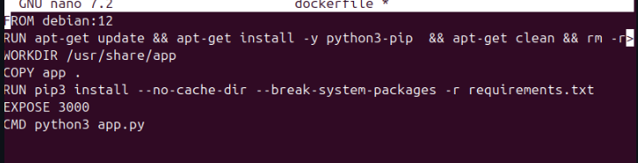
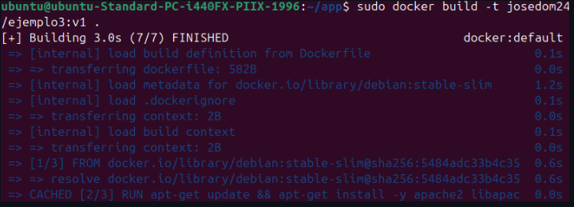
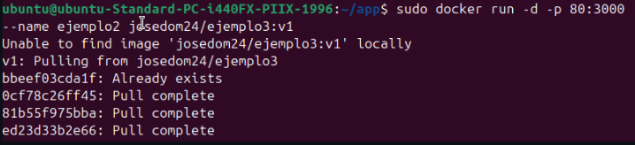
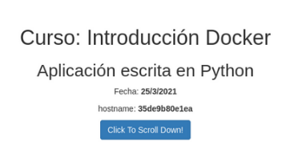

# Docker Práctica 6
## Construcción de imágenes con una una aplicación PHP
Primero vamos a crear un archivo dockerfile para nuestra app
 

 
Ya creado nuestro archivo Dockerfile, vamos a construir la imagen a partir del ejemplo de github
 

 
Ejecutamos el contenedor
 

 
Y como podemos ver funciona correctamente
 

 
## Construcción de imágenes con una una aplicación Python
Primero vamos a crear un archivo dockerfile para nuestra app
 

 
Ya creado nuestro archivo Dockerfile, vamos a construir la imagen a partir del ejemplo de github
 

 
Ejecutamos el contenedor
 

 
Y como podemos ver funciona correctamente
 

